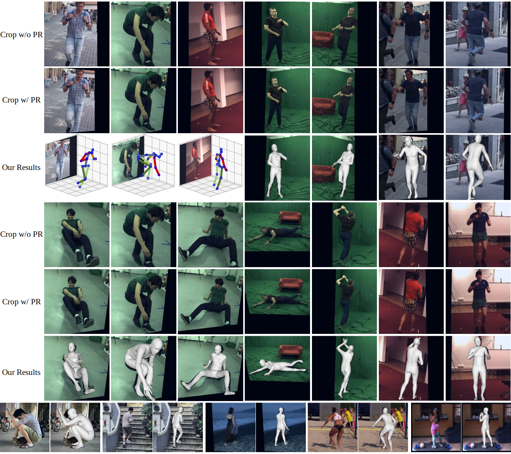
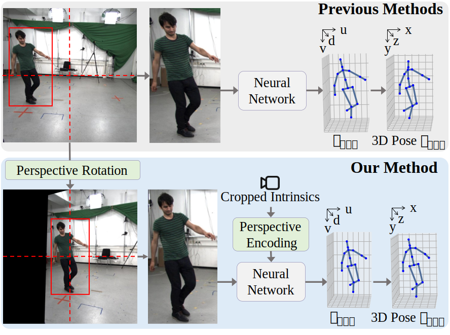

<h3 align="center">PersPose: 3D Human Pose Estimation with Perspective Encoding and Perspective Rotation<br>(ICCV 2025)</h3>
<h4 align="center" style="text-decoration: none;">Xiaoyang Hao*, Han Li*</h4>

<h4 align="center">
  <a href="https://arxiv.org/abs/2508.17239" target="_blank">[arXiv]</a> /

[//]: # (  <a href="" target="_blank">[paper]</a> /)

[//]: # (  <a href="" target="_blank">[video]</a>)
</h4>





## Introduction
This is the offical Pytorch implementation of PersPose, which estimates the 3D positions of joints from individual images. 
Below is the overall framework.

<p align="center">
  
</p>
We design Perspective Encoding (PE) to encode camera intrinsics, which is necessary (see Figure 2,3 in our paper).
Moreover, we propose Perspective Rotation (PR) to reduce perspective distortions and simplify the perspective relationship between the 3D scene and
the cropped image.

## Installation

This code is tested on Ubuntu 20.04 with Pytorch 1.13.1 and Python 3.9.17.

```bash
conda create -n perspose python=3.9.17
conda activate perspose
conda install pytorch==1.13.1 torchvision==0.14.1 torchaudio==0.13.1 pytorch-cuda=11.7 -c pytorch -c nvidia
pip install -r requirements.txt
wandb login # paste your wandb API key when prompted.
```

## Data Preparing

1. Download [SMPL model files]( https://download.is.tue.mpg.de/download.php?domain=smpl&sfile=SMPL_python_v.1.1.0.zip) ( basicmodel_f_lbs_10_207_0_v1.1.0.pkl, basicmodel_m_lbs_10_207_0_v1.1.0.pkl, and basicmodel_neutral_lbs_10_207_0_v1.1.0.pkl) 
   to `./data/smpl_file/`. Please rename them as SMPL_FEMALE.pkl, SMPL_MALE.pkl, and SMPL_NEUTRAL.pkl, respectively.   
2. Download [SMPL related files](https://drive.google.com/drive/folders/1ok_2IFvJ3PJr97IEfESav6Qmi50KTjtQ?usp=sharing) (J_regressor_h36m_correct.npy, segm_per_v_overlap_from_surreal.pkl) to `./data/smpl_file/`.   
  
3. To train or evaluate, please prepare and link datasets to `./data/`. 
Also, download [processed annotation files](https://drive.google.com/drive/folders/1ok_2IFvJ3PJr97IEfESav6Qmi50KTjtQ?usp=sharing) for all datasets. (SMPL parameters for Human3.6M are from Mosh.)   

   | Dataset                                                            | Image path example |
   |--------------------------------------------------------------------|--------------------|
   | **[3DPW](https://virtualhumans.mpi-inf.mpg.de/3DPW/license.html)** | ./data/3dpw/imageFiles/courtyard_arguing_00/image_00000.jpg              |
   | Human3.6M                                                          | ./data/h36m/images/s_01_act_02_subact_01_ca_01/s_01_act_02_subact_01_ca_01_000001.jpg               |
   | [MPIINF-3DHP](https://vcai.mpi-inf.mpg.de/3dhp-dataset/)           | ./data/3dhp/mpi_inf_3dhp_train_set/S1/Seq1/images/S1_Seq1_V0/img_S1_Seq1_V0_000001.jpg               |
   | COCO                                                               | ./data/coco/train2017/000000155582.jpg               |
   | [BEDLAM](https://bedlam.is.tue.mpg.de/) (Optional)                 | ./data/bedlam/data/20221019_3_250_highbmihand/png/seq_000000/seq_000000_0000.png               |

4. To train, please download the pretrained HRNet checkpoint, [pose_hrnet_w48_256x192.pth](https://github.com/leoxiaobin/deep-high-resolution-net.pytorch), to `./data/ckpt/`.

## Run Demo (Inference)

To inference, you need to prepare python environment as detailed in the Installation section above. Also, you need to prepare SMPL model files and SMPL related files as detailed in the Data Preparing section above.
Moreover, you need to download a model weight file, e.g. ckpt_w_be_3dhp_35epochs.pth, from [here](https://drive.google.com/drive/folders/1ok_2IFvJ3PJr97IEfESav6Qmi50KTjtQ?usp=sharing).  

Next, prepare input images and the paired focal length. 
The photos taken by cameras or some phones have a [35 mm equivalent focal length](https://en.wikipedia.org/wiki/35_mm_equivalent_focal_length) attribute in their EXIF metadata. 
If not, you can first measure the horizontal FOV of your camera mannually, and then the 35 mm equivalent focal length can be calculated as: 
focal_length_35 = 36/2 / tan(FOV_Horizontal/2). (Width of 35 mm film: 36mm.)
Then, please add it to photos' EXIF, or rename your input images as {base_filename}_{focal_length_35}_f35.jpg, e.g. IMG_26_f35.jpg.

Finally, run the following command to inference, taking the images in directory `./demo/to_inference` as inputs, 
and there will be (PR) centered image crops and visualization of inference results in the folder `./demo/to_inference_res`.  

 ```bash
CUDA_VISIBLE_DEVICES=0 python ./src_PersPose/trainer.py --cfg ./src_PersPose/configs/config_w_be_3dhp.yaml --pretrained_ckpt ./data/ckpt/PersPose/ckpt_w_be_3dhp_35epochs.pth --inference ./demo/to_inference
 ```

## Training

Every experiment is defined by `config` files. 
Configs of the experiments in the paper can be found in the `./src_PersPose/configs/` directory.

Run the following command to train on **a single GPU** without BEDLAM dataset. 

 ```bash
CUDA_VISIBLE_DEVICES=0 python ./src_PersPose/trainer.py --cfg ./src_PersPose/configs/config_3dpw.yaml --wandb 3dpw_wo_be
 ```
Or run the following command to train on **multiple(4) GPUs** without BEDLAM dataset. 

 ```bash
CUDA_VISIBLE_DEVICES=0,1,2,3 torchrun --rdzv_backend=c10d --rdzv_endpoint=localhost:0 --nnodes=1 --nproc_per_node=4 ./src_PersPose/trainer.py --cfg ./src_PersPose/configs/config_3dpw.yaml --wandb 3dpw_wo_be
 ```


## Evaluation

Run the following command to evaluate the provided [checkpoints (model weights)](https://drive.google.com/drive/folders/1ok_2IFvJ3PJr97IEfESav6Qmi50KTjtQ?usp=sharing) on **a single GPU**. 

 ```bash
CUDA_VISIBLE_DEVICES=0 python ./src_PersPose/trainer.py --cfg ./src_PersPose/configs/config_3dpw.yaml --test --pretrained_ckpt ./data/ckpt/PersPose/ckpt_3dpw_16epochs.pth
 ```

Or run the following command to evaluate  on **multiple(4) GPUs**. 

 ```bash
CUDA_VISIBLE_DEVICES=0,1,2,3 torchrun --rdzv_backend=c10d --rdzv_endpoint=localhost:0 --nnodes=1 --nproc_per_node=4 ./src_PersPose/trainer.py --cfg ./src_PersPose/configs/config_3dpw.yaml --test --pretrained_ckpt ./data/ckpt/PersPose/ckpt_3dpw_16epochs.pth
 ```


| Test set     | PA-MPJPE | MPJPE | PVE  | Config                                           |
|--------------|------|-------|------|--------------------------------------------------|
| 3DPW         | 39.1 | 60.1  | 72.4 | [cfg](./src_PersPose/configs/config_3dpw.yaml)   |
| Human3.6M    | 28.3 | 43.0  | 52.7 | [cfg](./src_PersPose/configs/config_h36m.yaml)   |
| MPI-INF-3DHP | 54.4 | 71.9  | -    | [cfg](./src_PersPose/configs/config_3dhp.yaml)   |


## Citation

Cite as below if you find this repository helpful:

```bibtex
@InProceedings{PersPose_2025_ICCV,
    title     = {PersPose: 3D Human Pose Estimation with Perspective Encoding and Perspective Rotation},
    author    = {Hao, Xiaoyang and Li, Han},
    booktitle = {Proceedings of the IEEE/CVF International Conference on Computer Vision (ICCV)},
    year      = {2025},
}
```


## Acknowledgement

This repo is built on the excellent works [HybrIK](https://github.com/Jeff-sjtu/HybrIK) and [VirtualMarker](https://github.com/ShirleyMaxx/VirtualMarker). 